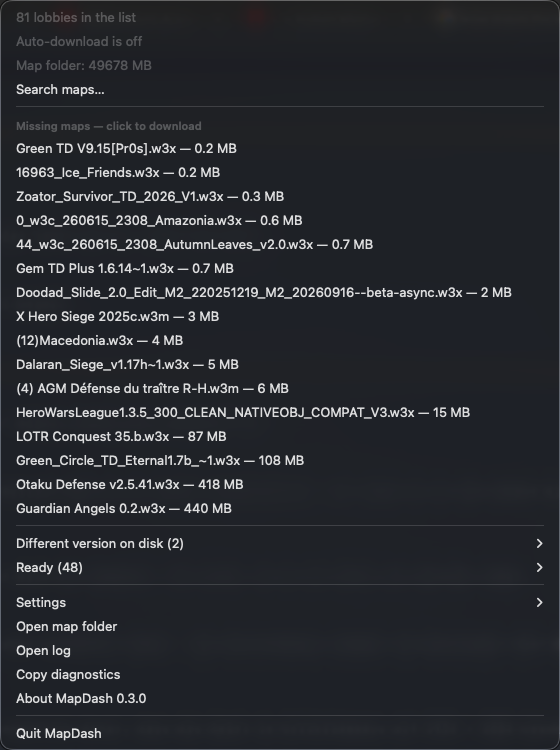
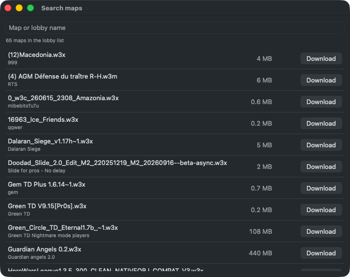
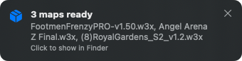

# MapDash

**Faster custom map downloads for Warcraft III: Reforged on macOS.**

On the Mac, the game downloads custom maps at a few hundred KB/s. MapDash reads the Custom Games
list from the running game and downloads the missing maps straight from Blizzard's map server
before you join, at full speed.

> [!WARNING]
> MapDash reads the game's memory (read-only). That is very likely against Blizzard's terms of
> service and could put your account at risk. **Use at your own risk.**
> Not affiliated with or endorsed by Blizzard Entertainment.

## Requirements

- macOS 13 or later
- An **administrator** account. Standard accounts are not supported.
- A private Mac. Security software on company-managed Macs flags memory reading.

It has been tested on Apple Silicon only.

## Install

1. Download `MapDash-<version>.zip` from [Releases](../../releases), unzip it, and move
   `MapDash.app` to *Applications*.
2. Open it. macOS blocks it the first time because it is not notarized. To allow it, go to
   *System Settings → Privacy & Security* and click **Open Anyway**.
3. Look for the box icon at the top right of the menu bar. MapDash has no window.

Later versions install from the menu: choose **Update available** and then **Install and Restart**.

## Use

Start Warcraft III and open the Custom Games list. Maps up to your size limit download
automatically. Larger ones are listed in the menu; click one to download it. To find a specific
map, choose **Search maps…** and type part of the map or lobby name.

When maps are ready, a small banner appears at the top right. Click it to show the maps in Finder.
The banner stays while the pointer is on it.

In the search window, **Return** downloads the top match and **Esc** closes the window. The menu
shows how many maps MapDash downloaded today and in total, and roughly how much time that saved
compared with the game's own download (about 250 KB/s).

To find old maps, choose **Unused maps…**. It lists the maps you have not used for a chosen time,
based on the file's last access date. You can show them in Finder and delete them there if you
like; MapDash itself never deletes anything.

<p>
  
  
</p>
<p></p>

| Setting | Default |
|---|---|
| Download small maps automatically | on |
| Automatic up to (25 MB – no limit) | 50 MB |
| Downloads at once (1–3) | 2 |
| Speed limit per download | none |
| Notify when maps are ready | on |
| Start at login | off |

## Guarantees

- The game is only read. MapDash never writes to it or pauses it.
- A file is kept only if its SHA-1 matches the one the lobby advertises.
- Map files are never deleted or replaced.
- If a map already exists under a different file name, MapDash copies the local file instead of
  downloading it again.
- Downloads pause while less than 5 GB of disk space is free.
- An update is installed only if its SHA-256 matches the checksum GitHub shows for the release file.
  The previous version is kept in `~/Library/Application Support/MapDash/previous`.

## Troubleshooting

| Problem | What to do |
|---|---|
| No menu bar icon | On MacBooks with a notch, the notch can hide the icon when the menu bar is full. Quit some other menu bar apps. |
| *MapDash needs an administrator account* | Use an admin account. |
| *Warcraft III was updated* | A game patch probably changed how the game stores its lobby list. MapDash checks for an update right away. If there is none yet, choose **Report this on GitHub…**. |
| *No lobbies found* while the list is open | Check for a MapDash update, or choose **Report a problem…**. |
| *Update available* offers no install button | MapDash can only replace itself in a folder you can write to. Move it to *Applications* and open it from there. |
| *Different version on disk* | Your map folder has an older file with the same name. MapDash never replaces files, so the game downloads the new version itself. Click the entry to show the old file in Finder. |
| Firewall (e.g. Little Snitch) asks about `curl` | Allow it. MapDash uses `curl` to download from `ugc.cdn.warcraft3-prod.battle.net`. |

For anything else, choose **Report a problem…** in the menu. It copies the diagnostics and opens a
new [GitHub issue](../../issues); paste them there.

## Uninstall

1. Quit MapDash and delete the app.
2. Optionally, delete `~/Library/Application Support/MapDash` and `~/Library/Logs/MapDash.log`.

Downloaded maps stay in the game's folder.

## Build

Requires the Command Line Tools only (`xcode-select --install`):

```
scripts/build.sh      # -> build/MapDash.app, build/MapDash-<version>.zip
```

`Sources/Scanner/scanner.c` finds the lobby objects in the game's memory. Each object holds the
map path, the host and the map's SHA-1. Reading works without root because:
- the game binary carries `get-task-allow`;
- admin accounts are members of `_developer`.

The Swift app downloads each map from
`https://ugc.cdn.warcraft3-prod.battle.net/W3-maps-user/<sha1>.map`.

## License

MIT, see [LICENSE](LICENSE).
